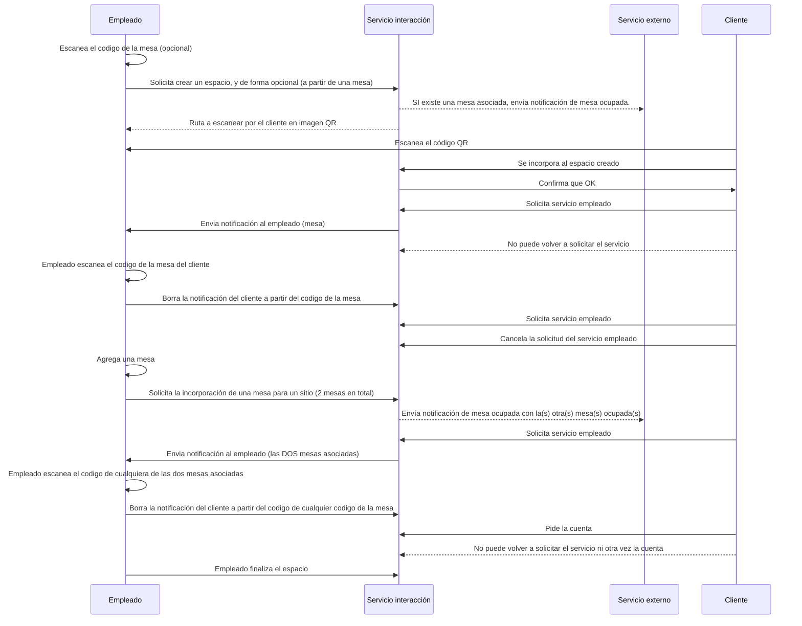
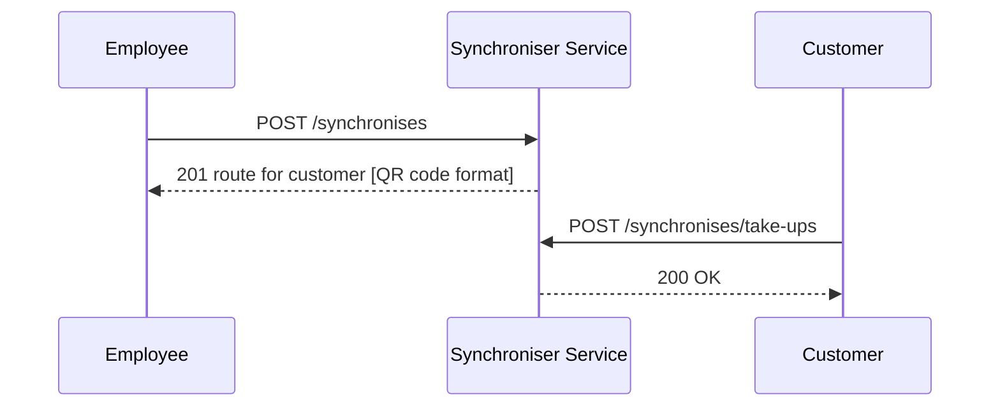

# iys project version 1.0.0
---
Microservices project iys

## iys-security
### Descripcion

Generate token with Basic authentication and storing public key management.

## iys-customer-employee-interaction
---
### Description

This service...
### Interaction Services
Contains API related to creating and retrieving all user information. In this service, we are also demonstrating how we use user's privilege in accessing the API. For example, the access to `GET ` `/interactions` endpoint will only be allowed for user whose `READ_BASIC_INFORMATION` privilege, but the access
 to other endpoints don't require any special privilege as long as it has correct scope. Please refer to spring security docs [here](http://projects.spring.io/spring-security-oauth/docs/oauth2.html) for more details.

### Secuencia completa empleado-cliente

---

---

| Method | Path                                     | Description                                                | Scope |  Privilege   | 
|--------|------------------------------------------|------------------------------------------------------------|-------|--------------|
| POST   | /interactions                            | Create customer space                                      | ui    | WRITE_ACCESS |
| GET    | /interactions/{code}                     | Get customer space with detail                             | ui    | ALL_ACCESS   |
| POST   | /interactions/{code}/orders              | Create customer service                                    | ui    | ALL_ACCESS   |
| DELETE | /interactions/{code}/orders              | Delete customer service by customer                        | ui    | ALL_ACCESS   |
| DELETE | /interactions/{code}/orders/{reference}  | Delete customer service by employee scanning any reference | ui    | ALL_ACCESS   |
| PUT    | /interactions/{code}                     | Add new reference into space                               | ui    | ALL_ACCESS   | 
| POST   | /interactions/{code}/bills               | Can i have the bill?                                       | ui    | ALL_ACCESS   |
| DELETE | /interactions/{code}                     | Delete customer space                                      | ui    | WRITE_ACCESS |
| GET    | /interactions                            | Get all customer spaces with details                       | ui    | WRITE_ACCESS |

# iys project version 2.0.0 - [TBD]
---
Microservices project iys

## iys-accounting
---
### Description
[TBD]

## iys-stock-control
---
### Description

[TBD]
https://www.camarero10.com/controlar-stock-de-cocina-en-un-restaurante/